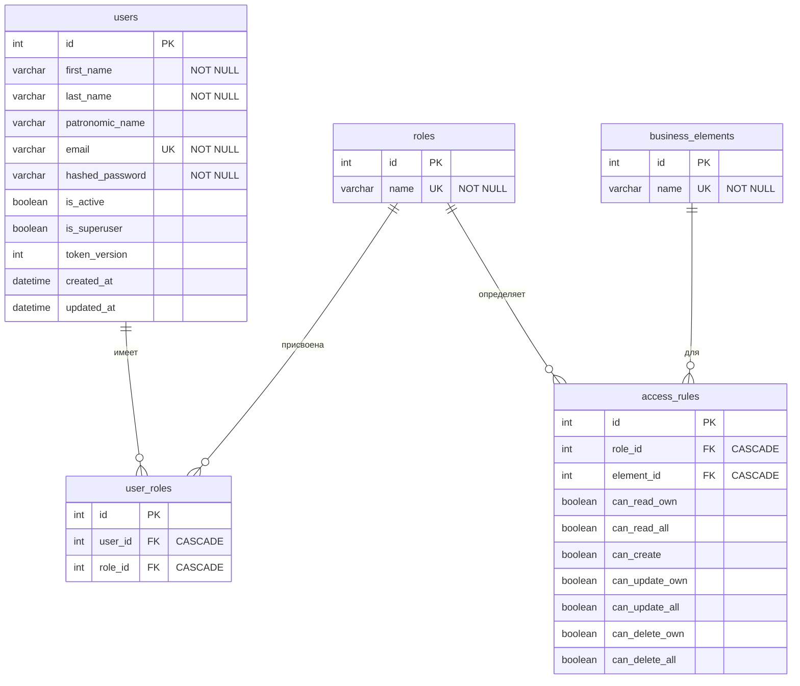

# access_app
# Система аутентификации и авторизации

## О проекте

Backend-приложение с собственной системой разграничения прав доступа (RBAC). Реализовано на FastAPI + SQLite. Основная цель — демонстрация понимания механизмов аутентификации (кто ты) и авторизации (что тебе можно).

### Технологии

- FastAPI + Uvicorn
- SQLAlchemy ORM
- SQLite
- JWT (python-jose) для токенов
- Bcrypt для хеширования паролей

## Схема базы данных

### Таблицы и связи


## Описание таблиц

| Таблица | Назначение |
|---------|------------|
| **users** | Пользователи системы: личные данные, email (для входа), хеш пароля, статус активности, флаг суперпользователя, версия токена для управления сессиями |
| **roles** | Справочник ролей (администратор, менеджер, пользователь и т.д.) |
| **user_roles** | Связь пользователей с ролями (многие-ко-многим) |
| **business_elements** | Справочник бизнес-сущностей (отчеты, клиенты, заказы) для разграничения доступа |
| **access_rules** | Правила доступа: какие действия (чтение/создание/обновление/удаление) и над какими объектами (своими/чужими) разрешены для каждой роли |

### Принцип работы прав доступа

Каждое правило определяет, что роль может делать с определённым типом объектов:

| Право | Описание |
|-------|----------|
| `can_create` | Создание новых объектов (owner = текущий пользователь) |
| `can_read_own` | Чтение своих объектов (owner_id = user.id) |
| `can_read_all` | Чтение любых объектов |
| `can_update_own` | Редактирование своих объектов |
| `can_update_all` | Редактирование любых объектов |
| `can_delete_own` | Удаление своих объектов |
| `can_delete_all` | Удаление любых объектов |

### Алгоритм проверки прав

1. Если пользователь не активен → доступ запрещён
2. Если пользователь `is_superuser = True` → доступ разрешён
3. Получаем все роли пользователя
4. Определяем нужное право в зависимости от действия и того, свой это объект или чужой
5. Если хотя бы одна роль даёт это право → доступ разрешён
6. Иначе → 403 Forbidden

## API Endpoints

### Публичные (аутентификация)

| Метод | Эндпоинт | Описание |
|-------|----------|----------|
| POST | `/api/register/` | Регистрация нового пользователя |
| POST | `/api/login/` | Вход, получение JWT токена |
| POST | `/api/logout/` | Выход (инвалидация всех токенов) |

### Защищённые (требуют JWT токен)

| Метод | Эндпоинт | Описание |
|-------|----------|----------|
| GET | `/api/profile/` | Получить профиль |
| PUT | `/api/profile/` | Обновить профиль |
| POST | `/api/profile/delete/` | Мягкое удаление аккаунта |
| GET | `/api/articles/` | Список статей |
| POST | `/api/articles/create/` | Создать статью |
| DELETE | `/api/articles/{id}/delete/` | Удалить статью |

### Admin API (требуют роль admin или is_superuser)

| Метод | Эндпоинт | Описание |
|-------|----------|----------|
| GET | `/api/admin/roles/` | Список всех ролей |
| POST | `/api/admin/roles/` | Создать новую роль |
| DELETE | `/api/admin/roles/{id}/` | Удалить роль |
| GET | `/api/admin/elements/` | Список бизнес-элементов |
| POST | `/api/admin/elements/` | Создать бизнес-элемент |
| GET | `/api/admin/rules/` | Список правил доступа |
| POST | `/api/admin/rules/` | Создать/обновить правило |
| POST | `/api/admin/assign-role/` | Назначить роль пользователю |

## Коды ошибок

| Код | Описание |
|-----|----------|
| 200 | Успешный запрос |
| 201 | Успешное создание ресурса |
| 400 | Ошибка валидации данных |
| 401 | Не авторизован (нет токена или токен невалиден) |
| 403 | Доступ запрещён (нет прав на ресурс) |
| 404 | Ресурс не найден |


## Установка и запуск

### 1. Клонировать репозиторий

```bash
git clone <your-repo-url>
cd fastapi_auth_project
```

### 2. Создать виртуальное окружение

```bash
python -m venv venv
source venv/bin/activate  # Linux/Mac
# или
venv\Scripts\activate     # Windows
```

### 3. Установить зависимости

```bash
pip install -r requirements.txt
```

### 4. Создать файл .env

```env
SECRET_KEY=your-super-secret-key-change-in-production
ALGORITHM=HS256
ACCESS_TOKEN_EXPIRE_MINUTES=30
DATABASE_URL=sqlite:///./auth_app.db
```

### 5. Инициализировать базу данных

```bash
python scripts/init_db.py
```

### 6. Запустить сервер

```bash
uvicorn app.main:app --reload
```

Документация API: http://localhost:8000/docs

## Тестовые данные

После инициализации БД доступны:

| Email | Пароль | Роль | Права |
|-------|--------|------|-------|
| admin@example.com | admin123 | admin | Суперпользователь (всё разрешено) |
| john@example.com | user123 | user | Читает все статьи, создаёт/редактирует/удаляет только свои |
| jane@example.com | user123 | user | (аналогично) |

## Особенности реализации

### Logout через token_version
При каждом выходе поле `token_version` у пользователя увеличивается. JWT-токен хранит версию, при проверке они сравниваются. Это позволяет инвалидировать все старые токены одним действием.

### Мягкое удаление
При удалении аккаунта пользователь не удаляется из БД, а получает `is_active = False`. Он больше не может войти, но данные сохраняются.

### Свои vs чужие объекты
Система различает свои и чужие объекты через поле `owner_id`. Это позволяет настроить права так, чтобы пользователь мог редактировать только свои записи, но читать все.

## Тестирование в Postman

### 1. Регистрация
```
POST http://localhost:8000/api/register/
Content-Type: application/json

{
    "first_name": "Test",
    "last_name": "User",
    "email": "test@example.com",
    "password": "123456",
    "confirm_password": "123456"
}
```

### 2. Вход
```
POST http://localhost:8000/api/login/
Content-Type: application/json

{
    "email": "john@example.com",
    "password": "user123"
}
```
→ Копируем `access_token`

### 3. Запрос с токеном
```
GET http://localhost:8000/api/articles/
Authorization: Bearer <your-token>
```

### 4. Попытка удалить чужую статью (ожидаем 403)
```
DELETE http://localhost:8000/api/articles/1/delete/
Authorization: Bearer <john-token>
```

## Структура проекта

```
fastapi_auth_project/
├── app/
│   ├── routers/          # Эндпоинты API
│   │   ├── auth.py       # Регистрация, вход, выход
│   │   ├── profile.py    # Профиль пользователя
│   │   ├── articles.py   # Мок-объекты (статьи)
│   │   └── admin.py      # Admin API
│   ├── __init__.py
│   ├── main.py           # Точка входа
│   ├── config.py         # Настройки из .env
│   ├── database.py       # Подключение к БД
│   ├── models.py         # Модели SQLAlchemy
│   ├── schemas.py        # Pydantic схемы
│   ├── auth.py           # JWT, хеширование
│   ├── permissions.py    # Система прав
│   └── mock_articles.py  # Хранилище статей
├── scripts/
│   └── init_db.py        # Заполнение тестовыми данными
├── .env                  # Переменные окружения
├── requirements.txt      # Зависимости
└── README.md             # Документация
```
